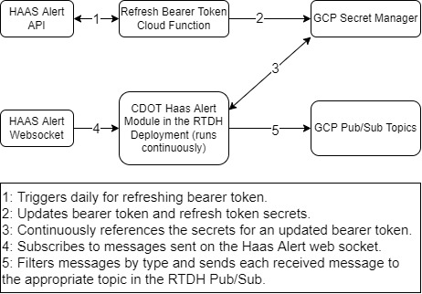

## Project Description

This project is an open source, proof of concept for hosting HAAS Alert data in the real time data hub hosted by CDOT. The purpose of this tool is to read off of the HAAS Alert websocket and post the received messages to a realtime data hub to get more information about the current status of traffic, incidents, and vehicle locations primarily in the Denver Metro area.

### System Diagram



## Prerequisites

Requires:

- Python 3.6 (or higher)
- GCP Credentials JSON

## Environment Setup

This code requires Python 3.6 or a higher version. If you haven’t already, download Python and Pip. Next, you’ll need to install several packages that we’ll use throughout this tutorial. You can do this by opening terminal or command prompt on your operating system:

```
pip install -r requirements.txt
```

Following this look at the sample.env file and create a copy called .env with each of the parameters assigned to a value. Also, in the haas_websocket directory look at the gcp_credentials_template.json file and supply a service account json file and rename it to gcp_credentials.json. In the .env file, all endpoints must end with a backslash (ex: www.google.com/) following the url otherwise the program will not parse the api endpoint or websocket variables properly.

Then set your environmental variables to access this file for the GCP pub/sub and secretmanager connectors as follows:

```
Windows: $env:GOOGLE_APPLICATION_CREDENTIALS="###PATH_TO_PROJECT###\haas_websocket\gcp_credentials.json"
Linux: export GOOGLE_APPLICATION_CREDENTIALS="###PATH_TO_PROJECT###/HAASAlert/haas_websocket/gcp_credentials.json"
```

## Running Haas Websocket

To start the HAAS Websocket, open a terminal window and run the following command in the root of the repository:

```
python -m haas_websocket.main
```

To run tests as well as to get code coverage from unit tests run the following set of commands in the root of the project:

```
coverage run -m pytest
coverage report -m
```
